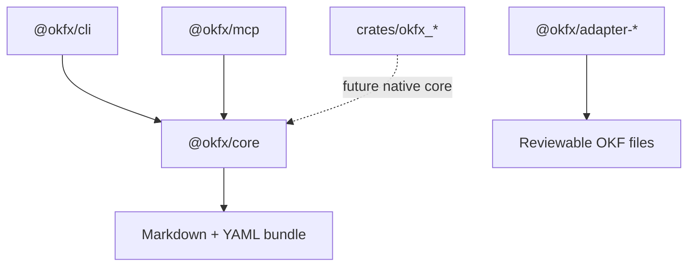

# okfx Architecture

## Responsibility

`okfx` owns local-first tooling for Open Knowledge Format bundles. It validates,
lints, formats, graphs, diffs, packs, indexes, and serves bundle context to
agents without requiring network access or LLM calls.

## Boundaries

- `@okfx/core` owns deterministic TypeScript APIs and JSON IR.
- `@okfx/cli` owns command UX and exit-code behavior.
- `@okfx/mcp` owns read-only MCP resources, tools, and prompts.
- Adapter packages produce reviewable files and MUST NOT silently mutate a bundle.
- Rust crates are scaffolded for future hot-path migration and do not yet own runtime behavior.

## Boundary Diagram

What this shows: current runtime behavior flows through TypeScript core; Rust is a future migration boundary.

## Verification

- TypeScript behavior: `npm run build && npm run typecheck && npm test`
- Dependency and audit gate: `npm audit --audit-level=moderate`
- Rust scaffold: `cargo test --workspace`
