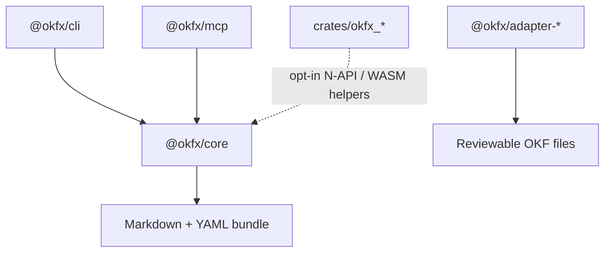

# okfx Architecture

## Responsibility

`okfx` owns local-first tooling for Open Knowledge Format bundles. It validates,
lints, formats, graphs, diffs, packs, indexes, and serves bundle context to
agents without requiring network access or LLM calls.

## Boundaries

- `@okfx/core` owns deterministic TypeScript APIs and JSON IR.
- `@okfx/cli` owns command UX and exit-code behavior.
- `@okfx/mcp` owns read-only MCP resources, tools, and prompts.
- Adapter packages produce reviewable files and MUST NOT silently mutate a bundle.
- Rust crates expose explicit JSON-boundary acceleration helpers and do not own the
  default Core/CLI runtime behavior.

## Boundary Diagram

What this shows: default runtime behavior flows through TypeScript core. Callers may
explicitly select accelerated helpers, which fall back without changing the default APIs.

## Verification

- TypeScript behavior: `pnpm build && pnpm typecheck && pnpm test`
- Dependency and audit gate: `pnpm audit --audit-level moderate`
- Rust scaffold: `cargo test --workspace`
